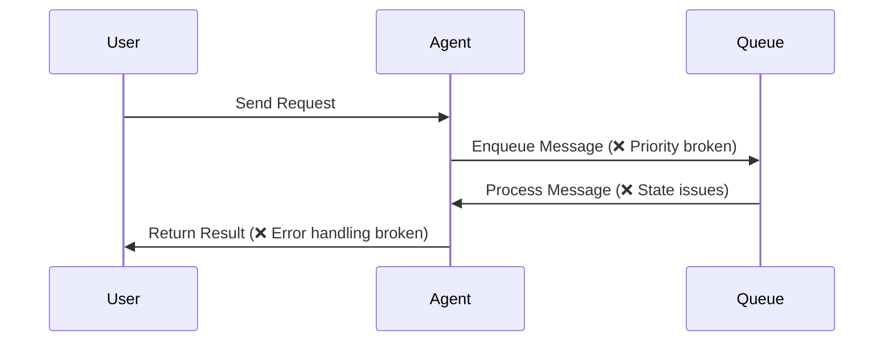
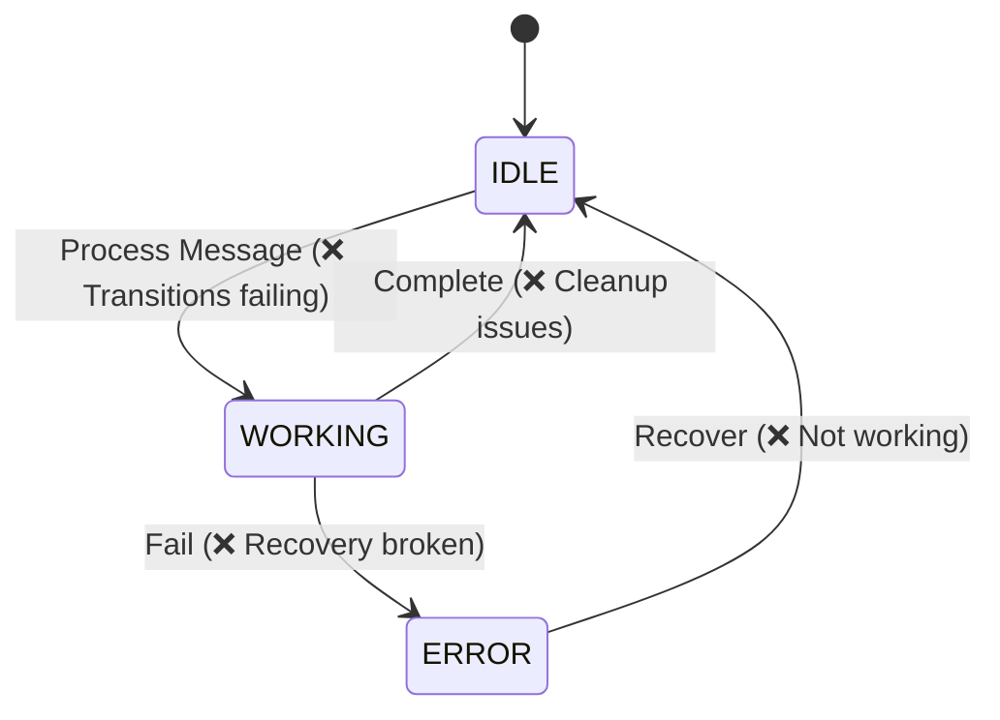

# Bolt.new Architecture Documentation

## System Overview

**Current State**: Initial agent framework implementation with failing tests

### Implemented Capabilities

1. Base agent framework
2. Message queue system (needs fixes)
3. Agent state management (needs fixes)
4. Basic test infrastructure

### Planned Capabilities (Not Implemented)

1. AI-powered code generation
2. In-browser execution via WebContainers
3. Real-time collaboration features
4. One-click Vite deployments
5. Agent-assisted error recovery

### Technical Foundation

| Category         | Technologies            | Status      |
| ---------------- | ----------------------- | ----------- |
| Framework        | Next.js 14 + TypeScript | ✅ Complete |
| Testing          | Vitest                  | 🚧 Failing  |
| Agent Framework  | Custom Implementation   | 🚧 Partial  |
| Message Queue    | Custom Implementation   | ❌ Broken   |
| State Management | Custom Implementation   | ❌ Broken   |

## Agent Framework Architecture

### Core Components

1. **BaseAgent** 🚧

   - Lifecycle management (needs fixes)
   - Message queue handling (needs fixes)
   - State transitions (needs fixes)
   - Error recovery (not working)

2. **OrchestratorAgent** 🚧

   - Message routing (needs fixes)
   - Agent registration (needs fixes)
   - Retry management (not working)
   - Error propagation (not working)

3. **CompatibilityAgent** 🚧

   - Version matrix management (needs fixes)
   - Compatibility checks (needs fixes)
   - Update recommendations (not implemented)
   - Version validation (needs fixes)

4. **ESLintAgent** 🚧

   - Code linting (needs fixes)
   - Auto-fixing (not working)
   - Rule enforcement (not working)
   - Error reporting (needs fixes)

5. **DeploymentAgent** 🚧
   - Build management (needs fixes)
   - Deployment tracking (not working)
   - Artifact validation (not implemented)
   - Health monitoring (needs fixes)

### Message Flow (Current Implementation)

### State Management (Current Implementation)

## Current Implementation Status

### Implemented But Needs Fixes

- 🚧 Base agent infrastructure
- 🚧 Message queue system
- 🚧 Agent lifecycle management
- 🚧 Basic error handling
- 🚧 Test framework

### Not Started

- ❌ OpenAI integration
- ❌ WebContainer setup
- ❌ Build pipeline
- ❌ Message persistence
- ❌ Resource management
- ❌ Security features

## Quality Attributes

### Current Focus

- Fix failing tests
- Fix message queue implementation
- Fix state management
- Fix error handling

### Pending

- All other quality attributes are pending implementation

## Next Steps

1. **Message System Fixes**

   - Fix message validation
   - Fix priority queuing
   - Fix state management
   - Fix error recovery

2. **Testing Infrastructure**
   - Fix failing tests
   - Add missing test cases
   - Fix timeout handling
   - Fix state transition tests
